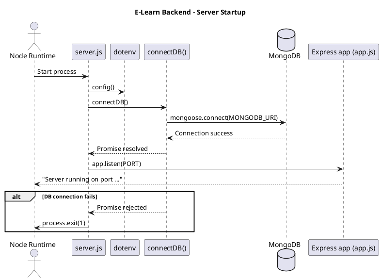
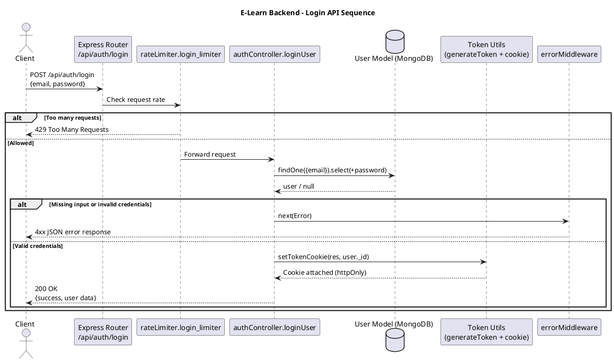

# Backend Sequence Diagrams (PlantUML)

## 1) Server Startup Flow

```puml
@startuml
title E-Learn Backend - Server Startup

actor "Node Runtime" as Node
participant "server.js" as Server
participant "dotenv" as Dotenv
participant "connectDB()" as DBConnect
database "MongoDB" as Mongo
participant "Express app (app.js)" as App

Node -> Server: Start process
Server -> Dotenv: config()
Server -> DBConnect: connectDB()
DBConnect -> Mongo: mongoose.connect(MONGODB_URI)
Mongo --> DBConnect: Connection success
DBConnect --> Server: Promise resolved
Server -> App: app.listen(PORT)
App --> Node: "Server running on port ..."

alt DB connection fails
DBConnect --> Server: Promise rejected
Server -> Node: process.exit(1)
end

@enduml
```

## 2) Auth Login Request Flow

```puml
@startuml
title E-Learn Backend - Login API Sequence

actor "Client" as Client
participant "Express Router\n/api/auth/login" as Router
participant "rateLimiter.login_limiter" as RateLimiter
participant "authController.loginUser" as Controller
database "User Model (MongoDB)" as UserDB
participant "Token Utils\n(generateToken + cookie)" as TokenUtil
participant "errorMiddleware" as ErrorMW

Client -> Router: POST /api/auth/login\n{email, password}
Router -> RateLimiter: Check request rate

alt Too many requests
RateLimiter --> Client: 429 Too Many Requests
else Allowed
RateLimiter -> Controller: Forward request
Controller -> UserDB: findOne({email}).select(+password)
UserDB --> Controller: user / null

alt Missing input or invalid credentials
Controller -> ErrorMW: next(Error)
ErrorMW --> Client: 4xx JSON error response
else Valid credentials
Controller -> TokenUtil: setTokenCookie(res, user._id)
TokenUtil --> Controller: Cookie attached (httpOnly)
Controller --> Client: 200 OK\n{success, user data}
end
end

@enduml
```
