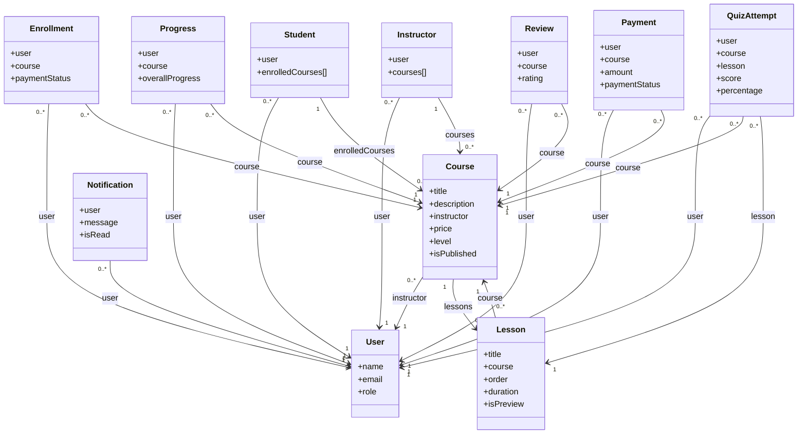

# Backend Models Class Diagram (Simplified)

```mermaid
classDiagram

class User {
  +name
  +email
  +role
}

class Student {
  +user
  +enrolledCourses[]
}

class Instructor {
  +user
  +courses[]
}

class Course {
  +title
  +description
  +instructor
  +price
  +level
  +isPublished
}

class Lesson {
  +title
  +course
  +order
  +duration
  +isPreview
}

class Enrollment {
  +user
  +course
  +paymentStatus
}

class Progress {
  +user
  +course
  +overallProgress
}

class QuizAttempt {
  +user
  +course
  +lesson
  +score
  +percentage
}

class Review {
  +user
  +course
  +rating
}

class Payment {
  +user
  +course
  +amount
  +paymentStatus
}

class Notification {
  +user
  +message
  +isRead
}

Instructor "0..*" --> "1" User : user
Student "0..*" --> "1" User : user
Course "0..*" --> "1" User : instructor
Lesson "0..*" --> "1" Course : course
Enrollment "0..*" --> "1" User : user
Enrollment "0..*" --> "1" Course : course
Progress "0..*" --> "1" User : user
Progress "0..*" --> "1" Course : course
QuizAttempt "0..*" --> "1" User : user
QuizAttempt "0..*" --> "1" Course : course
QuizAttempt "0..*" --> "1" Lesson : lesson
Review "0..*" --> "1" User : user
Review "0..*" --> "1" Course : course
Payment "0..*" --> "1" User : user
Payment "0..*" --> "1" Course : course
Notification "0..*" --> "1" User : user
Student "1" --> "0..*" Course : enrolledCourses
Instructor "1" --> "0..*" Course : courses
Course "1" --> "0..*" Lesson : lessons
```
